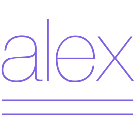

# Alex Browser Extension

- [Chrome](https://chrome.google.com/webstore/detail/alex/opjbkpkndiednghhgkilndleehjibpaf)
- [Firefox](https://addons.mozilla.org/en-US/firefox/addon/alex-language/)

From [Alex](https://github.com/get-alex/alex)' Docs:

> Whether your own or someone else’s writing, alex helps you find gender favouring, polarising, race related, religion inconsiderate, or other unequal phrasing in text.\
> For example, when We’ve confirmed his identity is given to alex, it will warn you and suggest using their instead of his.

This repo hosts the code for a browser extension that checks the text you're writing in your browser using Alex.

## FAQ

### Privacy

### What's the *Profanity Likeliness Threshold*?
The *Profanity Likeliness Threshhold* specifies how sure Alex needs to be about a profanity to warn you.
From Alex` docs:

| Rating | Use as a profanity | Use in clean text | Example |
| ------ | ------------------ | ----------------- | ------- |
| 2      | likely             | unlikely          | asshat  |
| 1      | maybe              | maybe             | addict  |
| 0      | unlikely           | likely            | beaver  |
